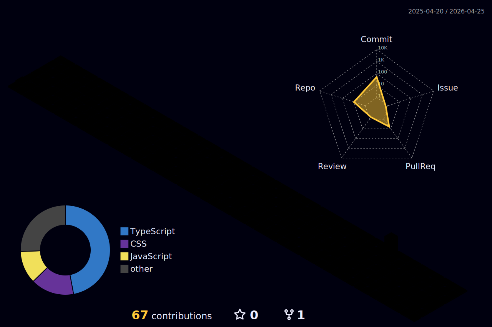

<div align="center">
  
[](https://git.io/typing-svg)

<br>

### 🌐 Conecte-se Comigo

[](https://br.linkedin.com/in/marcos-teixeira-dutra-j%C3%BAnior-204a912b4)
[](mailto:markdustlab@gmail.com)
[](http://wa.me/5511994765829)
[](https://github.com/MarcosTDJR/Import_Folio)


</div>

<br>


## 🚀 Sobre Mim

Desenvolvedor em formação, movido pela **curiosidade** e pela vontade de criar tecnologia que faça diferença. 

🎓 **Formação:**
- Técnico em Desenvolvimento de Sistemas - ETEC de Itaquera
- Desenvolvimento de Software Multiplataforma - Fatec Zona Leste

💼 **Experiência:**
- Full Stack Development
- Bancos de Dados SQL e NoSQL
- Análise, Manipulação e Visualização de Dados
- Segurança da Informação
- Infraestrutura e Arquitetura de Software

🌍 **Certificação:**
- TOEIC (780 pontos) - Preparado para contextos globais

<br clear="right"/>

💡 **Interesses:**
> Robótica • Automação • Inteligência Artificial • Machine Learning • Inovação • Astronomia • Biologia

<br>

---

## 💼 Áreas de Atuação

<div align="center">

| 🖥️ Desenvolvimento | 📊 Dados & Gestão | 🔒 Segurança | 🔧 Infraestrutura |
|:------------------:|:-----------------:|:------------:|:-----------------:|
| Programador FullStack | Cientista de Dados | White Hat | Manutencista de PC |
| Web & App Designer | Scrum Master | Analista de SOC | Redes de Computadores |
| Game Designer | - | - | Técnico em Eletrônica |

</div>

---

## 🛠️ Tecnologias & Ferramentas

<div align="center">

### 💻 Linguagens de Programação


### 🎨 Frameworks & Bibliotecas


### 🌐 Web Development


### 🗄️ Banco de Dados


### 🔧 Ferramentas & Outros


</div>

---

## 🎯 Competências Profissionais

<div align="center">

```
╔═══════════════════════════════════════════════════════════════════════╗
║                                                                       ║
║   🌟 Inovador  •  🎨 Criativo  •  📊 Analítico  •  ⚖️ Ético           ║
║                                                                       ║
║   💬 Comunicativo  •  ⚡ Proativo  •  🧘 Calmo  •  🎯 Crítico         ║
║                                                                       ║
║                   📚 Eterno Aprendiz  •  🚀 Determinado               ║
║                                                                       ║
╚═══════════════════════════════════════════════════════════════════════╝
```

</div>

---

## 📂 Portfólio

<div align="center">

### 🎮 Confira meus projetos no [**Portfólio Interativo**](https://github.com/MarcosTDJR/Import_Folio)

[](https://github.com/MarcosTDJR/Import_Folio)

</div>

---

## 💻 Desenvolvedor em Ação

<div align="center">

```
              ╭─────────────────────╮
              │   MARCOS CODING!    │
              ╰─────────────────────╯
                    
          🌿                    ☕
          |💚|        (⌐■_■)    (  )
         |🟤🟤|        __|__     '──'
         '───'        /     \
                      | -💻-|    
                      \_____/
                       |   |
                      👟  👟
                         
        ┌──────────────────────────────────┐
        │ $ whoami                         │
        │ > Full Stack Developer           │
        │                                  │
        │ $ status                         │
        │ > Coding and loving it! 😄       │
        │                                  │
        │ $ tech_stack                     │
        │ > Java | Python | React | More!  │
        │                                  │
        │ $ motto                          │
        │ > "Code, coffee, repeat" ☕      │
        │                                  │
        │ $ mission                        │
        │ > Transformar ideias em código! │
        └──────────────────────────────────┘
```

</div>

---

## 📊 Estatísticas do GitHub

<div align="center">
  


</div>

---

## 🏆 Troféus do GitHub

<div align="center">
  
[](https://github.com/ryo-ma/github-profile-trophy)

</div>

---

## 📈 Gráfico de Contribuições 3D

<div align="center">



</div>

---

## 🎯 Objetivos Atuais

```javascript
const marcos = {
    currentFocus: "Desenvolvimento Full Stack & Data Science",
    learningNow: ["Machine Learning", "Cloud Computing", "DevOps"],
    goals2026: [
        "Contribuir em projetos Open Source",
        "Lançar projeto próprio de impacto social",
        "Dominar arquitetura de microserviços",
        "Certificações em Cloud (AWS/Azure)"
    ],
    funFact: "Transformo café em código desde 2020! ☕➡️💻"
};
```

---

<div align="center">

### 💬 Frase Inspiradora

[](https://github.com/piyushsuthar/github-readme-quotes)

</div>

---

<div align="center">

### 💡 _"A tecnologia move o mundo, mas são as pessoas que movem a tecnologia."_

<br>

**✨ Obrigado pela visita! Vamos criar algo incrível juntos? ✨**

<br>

[](https://br.linkedin.com/in/marcos-teixeira-dutra-j%C3%BAnior-204a912b4)
[](mailto:markdustlab@gmail.com)

</div>

<br>


